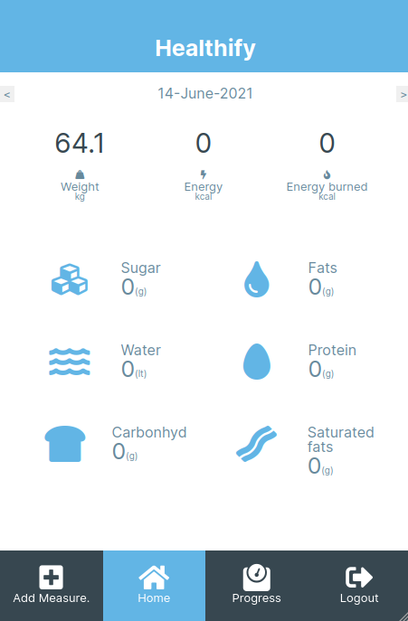

# Healthify

Healthify is a mobile tracking app for measuring weight and the nutritional intakes per day. The user can create an account and when he is logged in he can add his measurements and preview the total amount of the basic nutrients as well as the total amount of energy consumed and burned.
The app is connected to a REST API build in Ruby on Rails. The design of the project is inspired by [Gregoire Vella on Behance](https://www.behance.net/gregoirevella) and can be found [here](https://www.behance.net/gallery/13271423/Bodytrackit-An-iOs-app-Branding-UX-and-UI).

You can visit the repository for the backend of the project [here](https://github.com/patrick-angelos/tracking-api)

## Built With

- React.js
- Redux
- SCSS

## Getting Started

- `git clone git@github.com:patrick-angelos/tracking-app.git`
- `cd tracking-app`
- `npm install`
- `npm run start`

To run the tests: 
- `npm test`

## [LiveVersion](https://healthify-patrick.herokuapp.com/)

## Author

👤 **Patrikis Angelos**

- GitHub: [@patrick-angelos](https://github.com/patrick-angelos)
- Twitter: [@AngelosPatrikis](https://twitter.com/AngelosPatrikis)
- LinkedIn: [Angelos Patrikis](https://www.linkedin.com/in/angelos-patrikis-a590a61b5/)

## 🤝 Contributing

Contributions, issues, and feature requests are welcome!

## Show your support

Give a ⭐️ if you like this project!

## Acknowledgments

- To Microverse for their `README` template.

## 📝 [License](https://creativecommons.org/licenses/by-nc-nd/4.0/)
