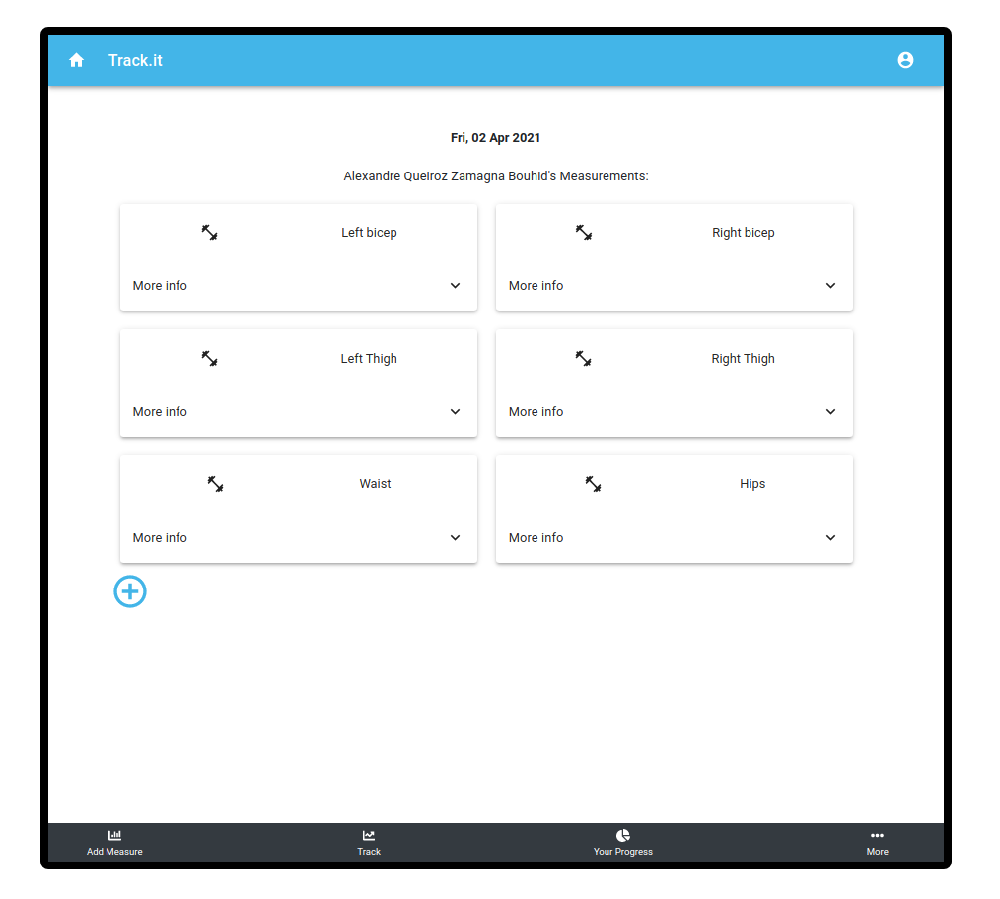
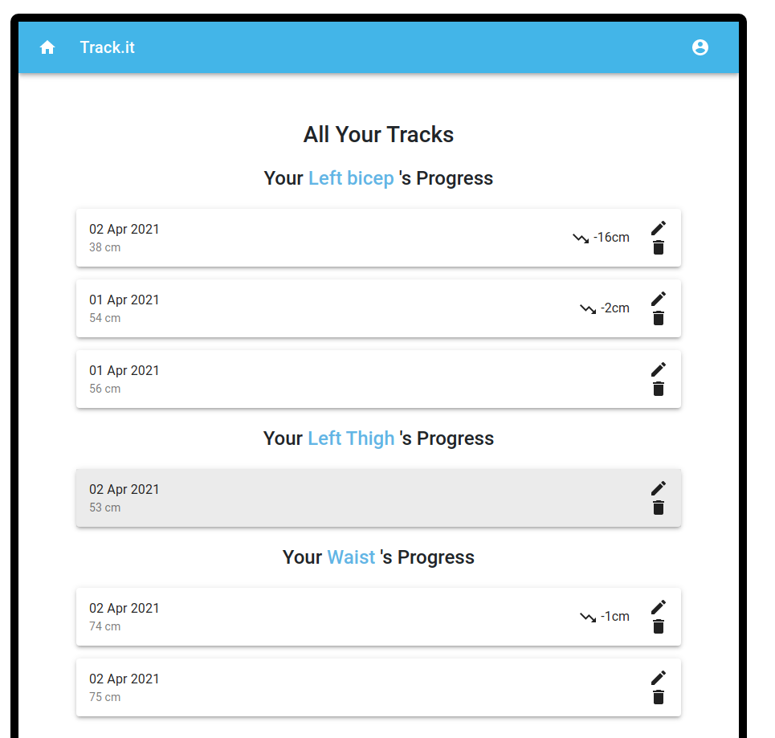

# TrackLife

This is the Final Capstone Project for the Microverse Program. It works alongside the [backend repo](https://github.com/Davidosky007/tracking-api-rails) and contains the following requirements:

- The project is a mobile web app
- The database has 2 tables (Measures and Measurements)
- It uses Postgres as a database
- Ruby on Rails was used for the back-end and to create a REST API
- React was used for the front-end and uses redux to store the info across the app
- The project is deployed accessible online
- Implemented 2 nice-to-have requirements: user authentication from the front-end to the server and a panel to create / update / delete things to measure;

## About

The projects consists of a tracking-app used to measure your progress on a diet/workout routine. You are able to:

- Sign in and Log in as a new user;
- Set your measures for the 6 default Measurements;
- Create a new set of Measurements as well as deleting any of them.

## Live Demo

## [LiveVersion](https://final-fianal.herokuapp.com)

## Built With

- React & Redux / React-Bootstrap / Material UI
- Javascript
- Ruby on Rails
- Axios
- JWT
- HTML / CSS

## Getting Started

To get a local copy up and running follow these simple example steps.

- Git clone https://github.com/Davidosky007/tracking-app-react.git
- Move to the root directory in your command line
- run `npm install`
- run `npm start`

To get the back-end running locally you will need to change the URL variable in src/api-requests/index.js to the back-end server URL generated.

👤 **David Bassey**

* GitHub: [@davidosky007](https://github.com/davidosky007)
* Twitter: [@davidosky2](https://twitter.com/Davidosky2)
* LinkedIn: [David Bassey](https://www.linkedin.com/in/david-bassey-akan/)

## 🤝 Contributing

Contributions, issues, and feature requests are welcome!

## Show your support

Give a ⭐️ if you like this project!

## Acknowledgments

- To Microverse for their `README` template.

## 📝 [License](https://creativecommons.org/licenses/by-nc-nd/4.0/)
